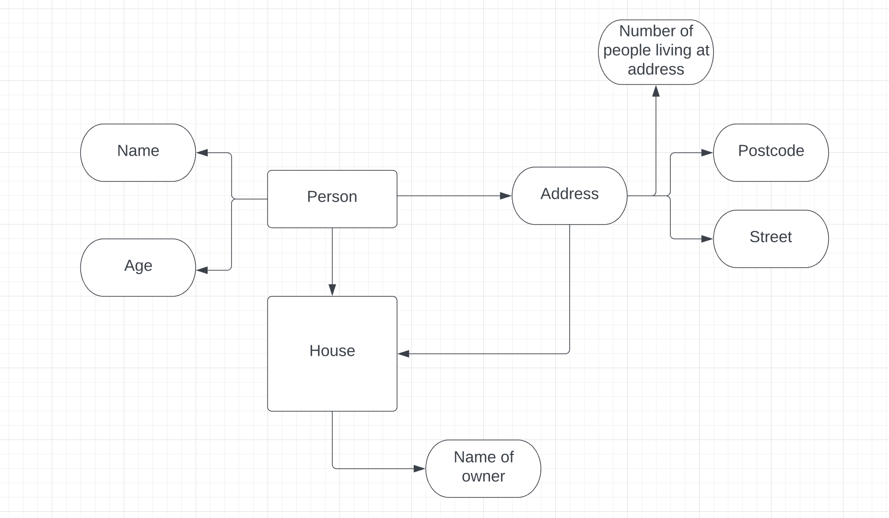

# Neighbourhood Collaboration :smile:

#### We have two tables:
- Person table with:
    - Name, age, house id and householdNum
- House table:
    - House id, postcode, street address and owner
---
#### Routing:
- For our get routes:
    - `/person` would show the info in the person table
    - `/house` would show the info in the house table
    - `/:id` uses house id to show info specific to the house, including all tenants
    - `/:names` info of one person and the house they live in (including owner)
---
#### Query Params:
- To look up people in our neighbourhood within certain age brackets and with specific household sizes:
    - `/person?age=20-30&householdNum=5`

